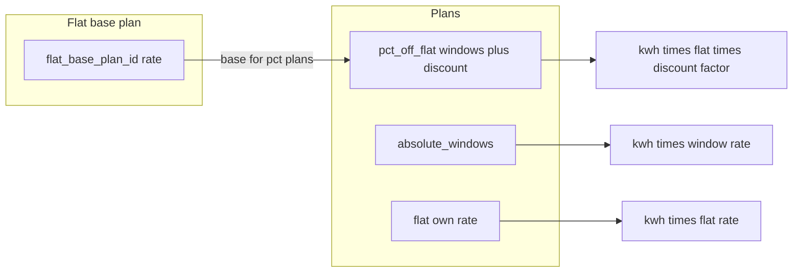
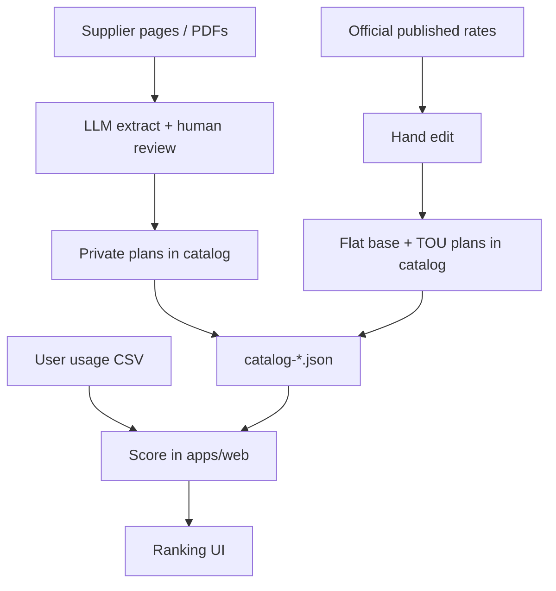

# OptiVolt architecture

Multi-market electricity tariff matcher. Monorepo. Two runtimes, one **catalog pack** (one dated file per market).

## Goals

- Rank supplier plans against a household usage CSV.
- Keep ranking deterministic (no LLM in the user path).
- Extract messy **private supplier** plans offline (LLM) into a reviewed catalog.
- Maintain incumbent / TOU plans by hand in the same catalog.

## Core pricing model

1. Reference **flat** plan is a normal catalog plan (`flat_base_plan_id`).
2. Absolute TOU plans are normal plans (`absolute_windows`).
3. **`flat_base_plan_id` rate** is the **base** for all `%`-off plans in that catalog.
4. **Every non-flat plan has time windows** (per plan, not per supplier).
5. Inside a window: **absolute** price/kWh (market `currency`) or **discount %** off the flat base.

```text
% plan:     pay = kwh * flat_base * (1 - window_discount_pct/100)
absolute:   pay = kwh * window_rate
flat:       pay = kwh * flat_rate
```



Details: [design/catalog.md](design/catalog.md), [design/windows.md](design/windows.md).

## Monorepo layout

```text
optivolt/
  packages/catalog/
    manifest.json             # market → catalog path + default_supplier_id
    <market>/
      catalog-YYYY-MM-DD.json # suppliers + plans + windows
  apps/web/                   # TypeScript — Vite SPA + cost scoring
  tools/extract/              # Python — private supplier LLM extract
  docs/
    ARCHITECTURE.md
    design/
```

`apps/web` bundles catalogs via root `manifest.json` (market keys). `tools/extract` merges private plans into a market catalog. Windows live **on the plan**. No separate global tariff or TOU registry files.

First shipped sample market folder: `packages/catalog/il/` (data only — not part of the scoring kernel).

## Two products, one handoff

| Piece | Runtime | Audience | Responsibility |
|-------|---------|----------|----------------|
| Extract pipeline | Python + LLM | Maintainers | Private supplier pages/PDFs → draft plans; human review |
| Catalog maintain | Hand-edited JSON | Maintainers | Flat base + TOU plans, windows, market meta |
| User app | TypeScript (static SPA) | End users | CSV + supplier + plan → rank in browser |



## Design docs

| Doc | Contents |
|-----|----------|
| [design/catalog.md](design/catalog.md) | Catalog files, JSON shape, enums, lifecycle |
| [design/windows.md](design/windows.md) | Time window semantics, coverage, overnight wrap |
| [design/scoring.md](design/scoring.md) | User inputs, score steps, who ranks |
| [design/usage-csv.md](design/usage-csv.md) | Usage format adapters → canonical pulses |
| [design/apps.md](design/apps.md) | Web SPA + extract tool |

## v1 assumptions

- Manifest sets stable `currency`, `timezone`, `week_start`, `default_supplier_id`.
- Dated catalog sets `billing_period_months`, plans, `flat_base_plan_id`.
- Incumbent flat plan = `flat_base_plan_id`; TOU via `absolute_windows`; private discounts usually `pct_off_flat`.
- Standing: `fixed_per_period` in market currency.

## Non-goals (v1)

- User-facing server / accounts.
- Auto-live scrape without review.
- LLM inventing official incumbent rates.
- Separate global tariff or TOU registry files.
- `%` off a time-varying absolute TOU base (base is **flat** only).
- Tenure / stage UI (`discount_schedule` scoring).
- VAT calculation path beyond catalog `vat_included` flag.
- Exit fees, export credits, hybrid models.
- Next.js / SSR.
- Perfect split of kWh inside an hour across two windows (whole hour → one window by hour start).

## Open items (sample market data)

1. Real anonymized CSV row for the first usage format adapter — [usage-csv.md](design/usage-csv.md).
2. Real flat-base + TOU window tables for published catalogs (replace placeholders).
3. Confirm standing + energy cover real bills, or more fee lines.

## Build order

1. Sample catalog + `manifest.json` (done).
2. Score library + Vitest: pulse→hour aggregate, window match, overnight wrap, % off flat, daily fold (in progress / done).
3. Static WebUI: CSV adapter + supplier + plan → rank.
4. `tools/extract` MVP → draft windows → **coverage validate** → human merge.
