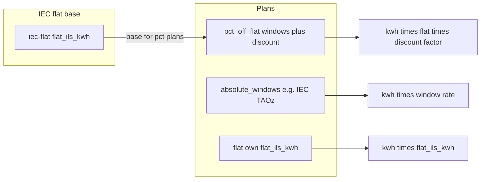
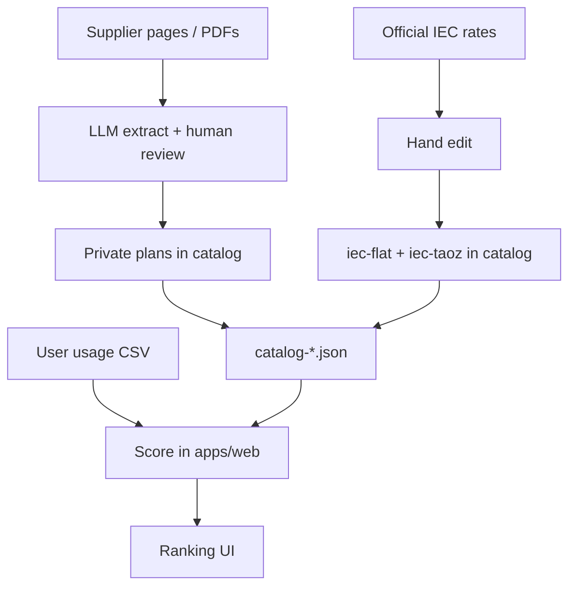

# OptiVolt architecture

Israel-first electricity tariff matcher. Monorepo. Two runtimes, one **catalog pack**.

## Goals

- Rank supplier plans against a household usage CSV.
- Keep ranking deterministic (no LLM in the user path).
- Extract messy **private supplier** plans offline (LLM) into a reviewed catalog.
- Maintain **IEC plans** (flat + TAOz) by hand in the same catalog.

## Core pricing model (IL)

1. **IEC is a normal supplier** in the catalog (`supplier_id: iec`).
2. **IEC flat** and **IEC TAOz** are **plans** (not a separate tariff file).
3. **IEC flat rate** is the **base** for all `%`-off private plans.
4. **Every non-flat plan has time windows** (per plan, not per supplier).
5. Inside a window: **absolute** ₪/kWh (e.g. TAOz) or **discount %** off IEC flat.

```text
private % plan:  pay = kwh * iec_flat * (1 - window_discount_pct/100)
IEC TAOz plan:   pay = kwh * window_rate_ils_kwh
IEC flat plan:   pay = kwh * flat_ils_kwh
```



Details: [design/catalog.md](design/catalog.md), [design/windows.md](design/windows.md).

## Monorepo layout

```text
optivolt/
  packages/catalog/il/
    catalog-YYYY-MM-DD.json   # suppliers + plans (incl. IEC)
    manifest.json             # which catalog file ships
  apps/web/                   # TypeScript — Vite SPA + cost scoring
  tools/extract/              # Python — private supplier LLM extract
  docs/
    ARCHITECTURE.md
    design/
```

`apps/web` bundles catalog via `manifest.json`. `tools/extract` merges private plans into the catalog. Windows live **on the plan**. No separate IEC tariff or global TOU registry files.

## Two products, one handoff

| Piece | Runtime | Audience | Responsibility |
|-------|---------|----------|----------------|
| Extract pipeline | Python + LLM | Maintainers | Private supplier pages/PDFs → draft plans; human review |
| IEC + catalog | Hand-edited JSON | Maintainers | IEC flat/TAOz plans + windows; market meta |
| User app | TypeScript (static SPA) | End users | CSV + supplier + plan → rank in browser |



## Design docs

| Doc | Contents |
|-----|----------|
| [design/catalog.md](design/catalog.md) | Catalog files, JSON shape, enums, lifecycle |
| [design/windows.md](design/windows.md) | Time window semantics, coverage, overnight wrap |
| [design/scoring.md](design/scoring.md) | User inputs, score steps, who ranks |
| [design/usage-csv.md](design/usage-csv.md) | Usage format adapters (v1: IEC) → canonical pulses |
| [design/apps.md](design/apps.md) | Web SPA + extract tool |

## Israel v1 assumptions

- Bill / CSV often **~2 months** (`billing_period_months: 2`).
- IEC in catalog: **flat = base**, **TAOz = absolute windows**.
- Private plans usually `pct_off_flat` with own windows.
- Standing: `fixed_ils_per_period`.

## Non-goals (v1)

- User-facing server / accounts.
- Auto-live scrape without review.
- LLM for IEC plans.
- Separate IEC tariff or global TOU registry files.
- `%` off IEC **TAOz** time-varying base (base is **flat** only).
- Tenure / stage UI (`discount_schedule` scoring).
- VAT calculation path (`vat_included` must stay `true`).
- Exit fees, export credits, hybrid models.
- Next.js / SSR.
- Perfect split of kWh inside an hour across two windows (whole hour → one window by hour start).

## Open before real IL numbers

1. CSV date/time string formats for **IEC** (sample row) — see [usage-csv.md](design/usage-csv.md). Other CSV formats later.
2. Real `iec-flat` ₪/kWh and full `iec-taoz` window table.
3. Confirm standing charges + energy cover real bills, or more fee lines.

## Build order

1. Sample catalog: `iec-flat`, `iec-taoz`, 2 private `pct_off_flat` plans + `manifest.json`.
2. Score library + self-check: pulse→hour aggregate, window match, overnight wrap, % off flat.
3. Static WebUI: CSV (IEC adapter) + supplier + plan → rank.
4. `tools/extract` MVP → draft windows → **coverage validate** → human merge.
