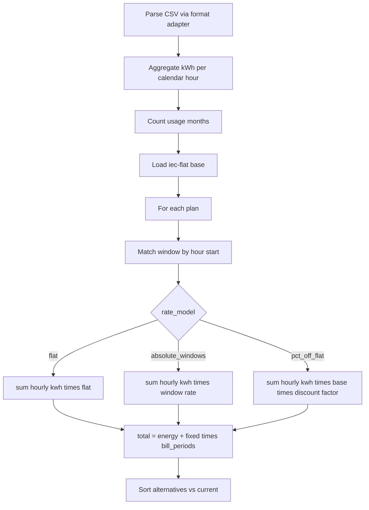

# Scoring design

Parent: [../ARCHITECTURE.md](../ARCHITECTURE.md). Catalog: [catalog.md](catalog.md). Windows: [windows.md](windows.md).

All in-browser. Import-only v1. Timestamps in `Asia/Jerusalem` (DST via TZ DB).

## Usage grain: per hour

Windowed plans (`pct_off_flat`, `absolute_windows`) need **time-of-day** usage. Monthly or period totals cannot pick a plan.

**Scoring unit = one hour of import kWh.**

1. Parse CSV via format adapter → pulses — [usage-csv.md](usage-csv.md).
2. **Aggregate to hours** (rules below).
3. Match each **hour** to a plan window by hour start.
4. Price each hour; sum.

```text
CSV → adapter → pulses → hourly_usage[{ hour_start, kwh }] → per plan: window(hour) → ₪ → total
```

### Pulse → hour

- Assign each pulse to the calendar hour of its **start**, floored: `14:45` → hour `14:00`–`15:00` (key `…T14:00`).
- Sum `kwh_import` for all pulses in that hour.
- **Sparse hours OK** — hours with no pulses omitted (contribute 0).
- **Partial last hour** — include as-is (whatever pulses exist); do not drop or extrapolate.
- Sub-hour pulses in the same hour merge before window match. v1 does **not** split a pulse across hours or windows.
- **DST:** use `Asia/Jerusalem` from the platform TZ DB. Spring missing hour = no bucket. Fall repeated hour = one local hour key as TZ API defines (no custom split).

Prefer plan window edges on whole hours — [windows.md](windows.md).

## User inputs (required with CSV)

| Input | Required | Meaning |
|-------|----------|---------|
| Usage CSV | Yes | Time-stamped pulses via a **format adapter** (v1: IEC) → hours — [usage-csv.md](usage-csv.md) |
| **Current supplier** | Yes | Incl. IEC |
| **Current plan** | Yes | Any catalog plan under that supplier, **incl. discontinued** |


No stage picker in v1.

**Switch-to:** other `active` plans. Exclude current (or show 0 savings).

## Steps



1. Parse CSV via format adapter → pulses `{ timestamp, kwh_import }` (v1: `iec`).
2. Aggregate → `hourly[]` = `{ hour_start, kwh }` (floor pulse start to hour; sparse OK).
3. `usage_months` = distinct calendar months that appear in `hourly`.
4. `base_flat =` catalog `iec_flat_plan_id` → `flat_ils_kwh`.
5. For each plan:
   - `bill_periods = usage_months / period_months` (proportional; e.g. 3 months ÷ 2 = 1.5). Period from `supplier.billing_period_months` ?? catalog default (IL = 2).
   - For each **hour**, first matching window (by `hour_start`); compute energy:

```text
flat:               hour.kwh * flat_ils_kwh
absolute_windows:   hour.kwh * window.rate_ils_kwh
pct_off_flat:       hour.kwh * base_flat * (1 - window.discount_pct/100)
```

   - `flat` plans may short-circuit: `total_kwh * flat_ils_kwh + fixed` (same result as looping hours).
   - `total_ils = Σ energy + fixed_ils_per_period * bill_periods`
6. Sort alternatives by `total_ils`. Delta vs current.

No matching window for an hour = scorer error (should never happen if catalog validate passed).

Reject or warn if CSV has **no time-of-day** (cannot build hourly series) — cannot rank windowed plans.

Optional UI: warn if usage date range is far from catalog `as_of` (rates may be stale).

## Who gets scored

| Mode | Included |
|------|----------|
| Current (baseline) | User-selected plan, **active or discontinued** |
| Switch-to ranking | Other `active` plans (all suppliers, incl. other IEC plan) |
